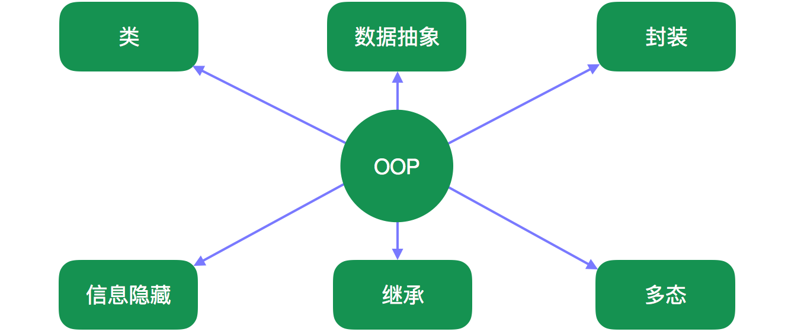

## 面向对象编程

**面向对象编程**是一种基于`对象`的编程范式，对象以字段（field,attribute,property）的形式包含数据，以方法的形式包含过程代码。
对象的过程代码可以访问并修改**被关联对象**的数据。在面向对象的程序设计中，计算机程序的设计就是在设计互相交互的对象。
面向对象的语言是多种多样的，最流行的是基于`class`的，对象是`class`的实例，而`class`是对象的类型。

许多被广泛使用的编程语言都是多范式的，有的对面向对象编程支持的多一点，有的支持的少一点，在支持面向对象编程的同时，也会支持结合面向过程的编程范式。

### 对象和类

支持面向对象编程的语言通常以类或原型来实现继承，从而实现代码复用和可扩展性。基于类的方式有两个主要概念：

* **类** - 用于定义给定类型的对象的数据格式和处理过程。
* **对象** - 类的实例。

有时，对象对应着可以在真实世界中找到的事物。比如，一个图形化程序可能包含“圆”，“正方形”和“菜单”这些对象。一个在线购物系统可能包含“购物车”，“顾客”和“商品”这些对象。
而有时，对象会代表更抽象的实体，比如用来代表一个打开的文件，或者代表一个尺寸转换服务。

每个对象都是一个特定类的实例。在面向对象编程中，处理过程被称作方法（method）；变量被称作字段（field，attribute，property）。这产生了如下术语：

* **类变量** - 作为一个类的整体的一部分，是属于类的，每个类只有一份。
* **实例变量** - 属于单个对象的数据，每个对象都有一份自己的副本。
* **成员变量** - 作为实例变量的一种，但是是由一个类定义的对象。
* **类方法** - 作为一个类的整体的一部分，是属于类的。它只能访问类变量和被调用时的入参。
* **实例方法** - 属于单个对象，可以访问方法调用者对象的实例变量，入参和类变量。

对象的访问有点类似于内部结构复杂的变量，许多语言采用指针访问对象，该指针也就成了堆栈中一个实例对象的引用。对象提供了一个抽象层将内部代码从外部代码中分离出来。外部代码可以读取实例变量，修改实例变量，或者使用特定参数集调用对象的实例方法。对象是通过调用类中被称为构造器的特殊方法创建的。一个程序的同一个类在运行时可以创建多个实例，这些实例之间是互相独立运行的。这就是一种简单的以不同的数据运行同一段过程代码的实现方式。

使用类的面向对象编程有时被称为基于类的编程，而基于原型的编程通常不使用类。

而某些语言的类和对象使用其他概念组成，比如trait和mixin。

### 基于类 vs 基于原型

在基于类的语言中，先定义类，然后使用类初始化对象。假如 *apple* 和 *orange* 这两个对象都是从 **Fruit** 类实例化出来的，那么它们本质上都是水果，可以使用处理水果的方式来处理它们。比如，程序员可以在它们身上预期一些相同的属性：color，sugar_content（糖分含量），或is_ripe（是否成熟）。

在基于原型的语言中，对象才是主要实体，而不是类，甚至可以没有类的存在。一个对象的原型就是该对象链接到的另一个对象。每个对象都有一个原型链（而且只有一个）。在创建新对象时可以选择已经存在的对象作为原型。假如存在 *fruit* 对象，只要将其作为 *apple* 和 *orange* 对象的原型，就可以把这两种不同的对象都称作水果。水果类这一概念并不明确存在，但对于共享同一原型对象的其它对象来说，该原型对象就等价于类。原型的属性和方法，都被委托给了由该原型所定义的等价类的实例对象。而一个对象自己的属性和方法不会被共享着同一等价类的其他对象所共享。比如，sugar_content（糖分含量）属性可能出乎意料的不在 *apple* 中。通过原型只能实现单继承。

### 动态调度/消息传递

为一次方法调用选择待执行的过程代码，是对象的责任，与外部代码无关，这个过程通常是运行时在与该对象关联的方法表中查找。这个功能叫做**动态调度**，它给了一个类的所有实例一个固定的操作实现，这把实例化的对象和抽象化的类型区分开了。当调用和被选中代码之间的关系不仅仅依赖于被调用对象的类型时（也就是说，选择被调用的代码这件事至少还涉及一个其他参数），这种情况叫做多重调度。

方法调用也被称作消息传递。这是将方法调用理解成，向对象发送一个消息（消息内容是方法名称和传给方法的参数），以进行下一步的调度。

### 封装

封装是一种面向对象的编程概念，它将数据和操作数据的函数绑在一次，并保护二者免受外部干扰和误用。数据封装又引入了重要的OOP概念：数据隐藏。

如果一个类不允许调用代码访问其对象的内部数据，并且只允许通过方法访问，这就是一种强抽象形式，或强信息隐藏形式，被称作封装。有些语言（比如Java）让类可以明确的实施访问限制，比如使用`private`表示一个字段是内部数据，使用`public`表示一个类的方法可被外部调用。方法可以被设计为公开的，私有的，或者一个中间级别的，比如`protected`（从其所在的类和该类的子类中可以访问，其他类的对象不能访问）。其他语言（比如Python）可以约定另一种形式的访问限制（比如，可以使用以下划线开头来命名的方式实现私有方法）。封装帮助一个对象阻止了外部代码与其内部的工作有关。这有助于代码重构，比如，一个类的作者可以修改该类的对象在内部表示数据的方式，而不用修改任何外部代码。封装还鼓励程序员将与特定数据集相关的代码都放到同一个类中，良好的封装有助于程序员理解一个类。封装是一种鼓励解耦的技术。

### 组合和继承

一个对象的实例变量可以是另一个对象，这被称作**对象组合**。比如，Employee类的一个实例对象可能包含一个Address类的实例对象。对象组合用于表示`has-a`关系：每位员工都有地址，所以每个Employee对象都要访问一个Address对象（无论是以直接嵌入的方式，还是利用指针定位到另一个位置的方式）。

支持类的语言几乎都支持**继承**。它可以使用`is-a-type-of`关系来安排类的层次结构。比如，Employee类可能继承自Person类。父类的数据和方法也可以以相同的名字出现在子类中。例如，Person类使用“make_full_name()”方法定义了“first_name”和“last_name”，它们在增加了“position”和“salary”的Employee类中也是可用的。继承简化了相同过程代码和数据定义的重用，以直观的方式潜在地镜像了现实世界的关系。

子类可以覆盖父类定义的方法。有些语言支持“多重继承”，它会把方法覆盖的解析过程变得复杂。在支持多重继承的语言里，`mixin`只是一个不表示`is-a-type-of`关系的类，但有些语言对其还是有特殊的支持。比如，UnicodeConversionMixin类提供了一个unicode_to_ascii()方法，FileReader类和WebPageScraper类都混入了该类，即便它们没有共同的父类。

**抽象类**不能被实例化成对象。它的存在只是为了能被可以实例化的“具体”类给继承。在Java里，`final`关键字可以用于禁止一个类被继承。

有一个原则，叫组合优于继承原则，它提倡使用组合而不是继承来实现`has-a`关系。比如，Employee类可以给自己的每个实例对象一个内部的Person对象，而不是继承自Person对象，这样Employee类就有机会隐藏Person类的诸多方法和属性。有一些语言，比如**Go**语言，是不支持继承的。

另外，**开闭原则**主张类和函数应该对扩展是开放的，但对修改是封闭的。

### 多态

**子类型化** - 多态的一种形式 - 是在调用代码时，不知道被操作的类是所支持的类体系中的哪一个 - 有可能是父类，也有可能是其任意子类。而与此同时，该继承体系下的对象，互相之间的同名操作可能行为不同。

比如，Circle和Square类型的对象都派生自Shape类。这些对象的draw()方法被调用时，都可以完成各自形状的绘制，但是调用方在调用时无需考虑特定的形状。

这是另一种类型的抽象，它简化了类层级结构之外的代码，同时增强了**关注点分离**。

### Open recursion

在支持 **Open recursion** 的语言中，对象的一个方法可以使用关键字`this`或`self`调用该对象的其他方法（也包括自身）。`this`或`self`是`late-bound`的，也就是在运行时才确定它们所代表的对象的类型，而不是在编译期确定。这使得在一个类中定义的方法，可以调用稍后在其子类中定义的另一个方法。

### SOLID

**SOLID**是由Michael Feathers（著有《修改代码的艺术》）发明的助记词，代表了OOP里的五种编程实践：

* **Single responsibility principle**：单一职责原则，它规定模块、类和函数都应该只负责软件的单一部分，并且这种责任应该完全由类封装。罗伯特 C. 马丁将这个原则表述为：一个类应该仅有一个被修改的原因。
* **Open/closed principle**：开闭原则，软件中的实体，比如模块、类、函数等等，应该对扩展开发，对修改封闭。
* **Liskov substitution principle**：里氏替换原则，如果S是T的子类型，T的实例对象可以被S的实例对象替换，而不必改变程序的属性（正确性、执行的任务等）。
* **Interface segregation principle**：接口隔离原则，接口的使用方不应该被强制的依赖于它不使用的方法。该原则将大接口拆分成更小且更明确的多个小接口，这样，接口的使用方就只需要了解自身关心的那部分。
* **Dependency inversion principle**：依赖倒置原则，它是一种解耦软件模块的特定方式。具体内容如下：
    * 上层模块不应该依赖下层模块，而是应该依赖抽象层，比如接口。
    * 抽象层不应该依赖具体实现，具体实现应该依赖于抽象层。

### 参考

[Object-oriented programming](https://en.wikipedia.org/wiki/Object-oriented_programming)
